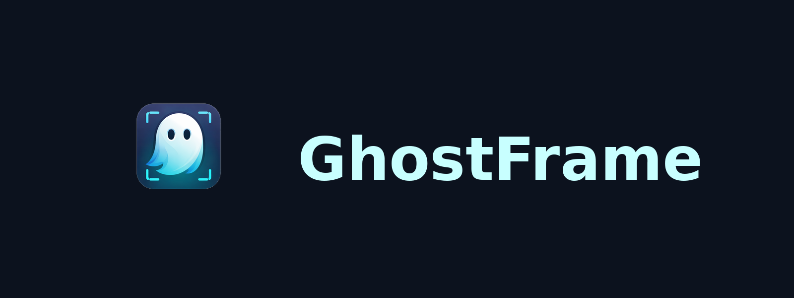

# GhostFrame

> 👻 **Stealth Mode Manager for macOS**

A beautiful, modern menu bar app with liquid glass UI that makes your Electron apps invisible to screenshots, screen recordings, and screen sharing.



  

## ✨ Features

### Core Features
- **🛡️ Content Protection** - Makes app windows appear black in screenshots and screen recordings
- **👻 Dock Hiding** - Optional: Hide app icons from the macOS dock when running
- **🎯 Mission Control Hiding** - Apps won't appear in Mission Control
- **🔄 Auto-Restart** - One-click restart for changes to take effect

### User Experience
- **📱 Add Any Electron App** - Browse and add apps from your Applications folder
- **📝 Manage Your List** - Add, remove, and configure apps as needed
- **⚙️ Per-App Settings** - Configure dock hiding individually for each app
- **💾 Persistent Settings** - Your configuration is saved automatically

### Settings & Customization
- **🎨 Liquid Glass UI** - Beautiful native macOS vibrancy effects
- **🔒 Show/Hide Menu Bar Icon** - Control GhostFrame's visibility
- **⌨️ Keyboard Shortcuts** - Quick access to all features:
  - Toggle GhostFrame window
  - Toggle stealth mode for all apps
  - Minimize/Maximize window

## 📸 Screenshots

| Menu Bar View | Add Apps | Settings |
|---------------|----------|----------|
| Main control panel with app toggles | Browse and add Electron apps | Configure shortcuts & preferences |

## 🚀 Installation

### Build from Source

```bash
# Clone the repository
git clone https://github.com/yourusername/GhostFrame.git
cd GhostFrame

# Build the app
chmod +x build.sh
./build.sh

# Install to Applications
cp -r build/GhostFrame.app /Applications/

# Run
open /Applications/GhostFrame.app
```

### Quick Install

```bash
./build.sh && cp -r build/GhostFrame.app /Applications/ && open /Applications/GhostFrame.app
```

## 📖 Usage

### Getting Started

1. **Launch GhostFrame** - Click the 👻 icon in your menu bar
2. **Add Apps** - Click "Add App" to browse available Electron applications
3. **Enable Protection** - Toggle the switch next to any app
4. **Configure Options** - Click the ⋯ button for per-app settings:
   - Toggle "Hide from Dock"
   - Restart the app
   - Remove from list
5. **Restart App** - Click "Restart Now" when prompted for changes to take effect

### Settings

Access settings via the ⚙️ button:

- **Show menu bar icon** - Hide GhostFrame from menu bar (use shortcut to access)
- **Launch at login** - Start GhostFrame when you log in
- **Keyboard Shortcuts** - Customize your shortcuts

### Keyboard Shortcuts (Default)

| Action | Shortcut |
|--------|----------|
| Toggle GhostFrame | ⌘⇧G |
| Toggle Stealth Mode | ⌘⇧S |
| Minimize Window | ⌘⇧M |
| Maximize Window | ⌘⇧F |

## 🔧 How It Works

GhostFrame patches Electron apps to enable macOS content protection APIs:

```javascript
// Applied to each Electron app
import { app } from 'electron';

// Optional: Hide dock icon
app.dock.hide();

// Apply content protection to all windows
app.on('browser-window-created', (event, window) => {
    window.setContentProtection(true);
    window.setHiddenInMissionControl(true);
});
```

### What Gets Protected

| Feature | Description |
|---------|-------------|
| `setContentProtection(true)` | Windows appear black in screenshots & recordings |
| `setHiddenInMissionControl(true)` | Hidden from Mission Control |
| `app.dock.hide()` | Removes dock icon (optional per-app) |

### Data Storage

- **Backup files**: `*.ghostframe.backup` (alongside original files)
- **Settings**: `~/Library/Preferences/com.ghostframe.stealth.plist`
- All changes can be reverted by toggling protection off

## 🎨 UI Features

- **Liquid Glass Effect** - Uses `NSVisualEffectView` with `.hudWindow` material
- **Animated Toggles** - Smooth spring animations
- **Hover Effects** - Interactive card animations
- **Status Indicators** - Green/orange dots for protection status
- **Running State** - Blue indicator for running apps
- **Search** - Filter apps when adding new ones

## 💻 Supported Apps

GhostFrame automatically detects Electron-based applications including:

- Antigravity
- Visual Studio Code
- Cursor
- Windsurf
- Slack
- Discord
- Notion
- Figma
- Obsidian
- Postman
- Spotify
- WhatsApp
- Telegram
- 1Password
- *...and any other Electron app!*

## 📋 Requirements

- macOS 13.0 (Ventura) or later
- Xcode Command Line Tools (for building)

## 🛠️ Development

### Project Structure

```
GhostFrame/
├── GhostFrame.swift    # Main application source
├── build.sh            # Build script
├── README.md           # Documentation
└── assets/             # Icons and images
```

### Building

```bash
# Development build
./build.sh

# The app will be at build/GhostFrame.app
```

## 📄 License

MIT License - Feel free to use, modify, and distribute.

## ⚠️ Disclaimer

This tool is intended for privacy protection during legitimate use cases such as:
- Online assessments and exams
- Presentations and demos
- Personal privacy

Use responsibly and ethically. The developers are not responsible for misuse.

---

Made with ❤️ for privacy
